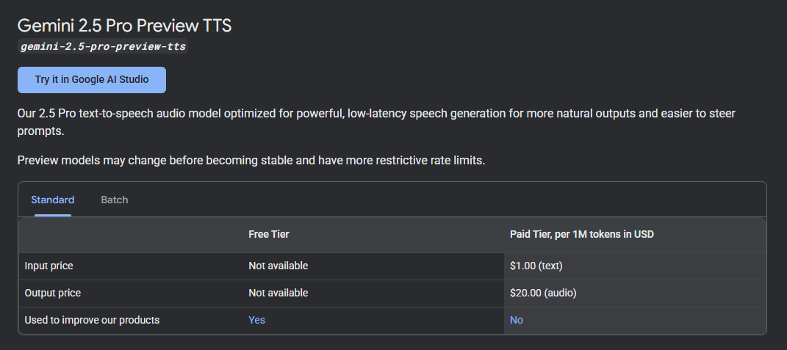
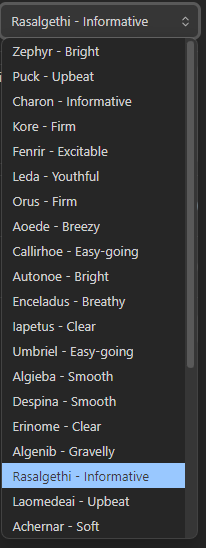

# Obsidian Gemini TTS

This Obsidian plugin was quickly generated using Gemini 3 because reading long notes and documents is wholeheartedly tiering, especially when you start to think "It's year 2025, I should be able to get anything read for me outloud without another extra convulated third-party services", so I solved that easily with Gemini.

 

> Note! You might need a Paid Tier on the key to use the model, but I have not tested it myself with free tier key.
Or even if this plugin works for other TTS models, feel free to fork and experiment.

## Features:

- 🎙️ **Natural Voice Synthesis**: Uses Google Gemini's advanced TTS models and is clever enough to skip over code snippets.
- 🎭 **Multiple Voices**: Choose from all the voices that their TTS models have to offer.
- 🎨 **Customizable Style**: Adjust reading style with custom prompts
- 📱 **Cross-Platform**: Works on desktop and mobile <- TODO: Check if it actually works in Mobile.

## Installation

### Manual Installation <- Easy

1. Download the latest release from GitHub
2. Extract the files to your vault's `.obsidian/plugins/gemini-tts/` folder
3. Reload Obsidian
4. Enable the plugin in Settings → Community Plugins
5. Get a Google Gemini API key from [Google AI Studio](https://aistudio.google.com/app/api-keys)
6. Open Obsidian Settings → Gemini TTS
7. Enter your API key
8. Customize other settings as desired

### Status Bar

The status bar at the bottom shows the current state:
- "Generating..." - Fetching audio from Gemini API
- "Playing..." - Audio is currently playing
- "Stopped" - Playback has ended or been stopped
- "Error" - Something went wrong

## Settings

### API Key
Your Google Gemini API key (required). Get one from [Google AI Studio](https://aistudio.google.com/app/api-keys).

### Model Name
The Gemini model to use for TTS (default: `gemini-2.5-flash-preview-tts`).

### Voice Name
Choose from 5 different voices:
- **Puck**: Default voice <- TODO: Change the default one, it's way to flamboyant, and that's coming from a gay guy. 💁‍♂️

### Style Prompt
Instructions for how the text should be read (default: "Read clearly and naturally."). Customize this to change the reading style, pace, or emphasis.

### Skip Code Blocks
When enabled, code blocks (both inline and fenced) are removed from the text before reading (default: enabled).

## How It Works

1. The plugin extracts text from your active note
2. Removes markdown formatting, frontmatter, and optionally code blocks
3. Sends the cleaned text to Google's Gemini API
4. Receives base64-encoded audio
5. Plays the audio using HTML5 Audio

## Privacy & Data

- Your notes are sent to Google's Gemini API for processing
- Only the text content is sent (after markdown cleaning)
- No data is stored by the plugin
- See [Google's Privacy Policy](https://policies.google.com/privacy) for API data handling

## License

MIT License - see LICENSE file for details.

## Voices: 

